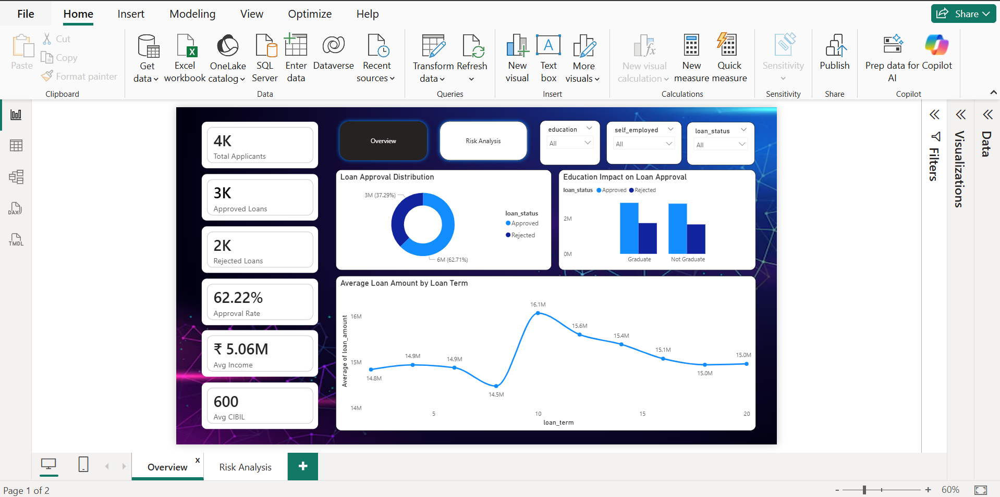
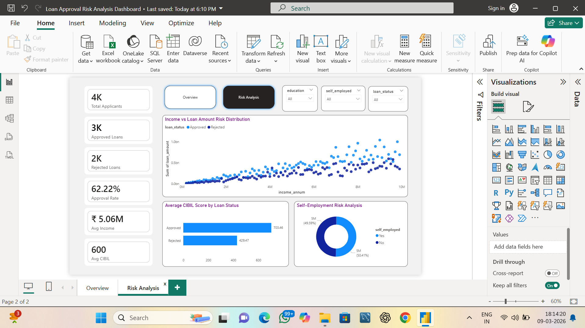

## Loan Approval Risk Analysis Dashboard | SQL + Power BI

This project analyzes loan approval patterns and applicant risk factors using SQL for data analysis and Power BI for interactive dashboard visualization.

The goal is to identify how credit score, income, education, and employment status influence loan approval decisions.

---

## Tools & Technologies

* **SQL (MySQL)** – Data querying and analysis
* **Power BI** – Interactive dashboard visualization
* **CSV** – Dataset source

---

## Dataset Information

The dataset contains loan applicant information including:

* Income
* Loan amount
* Loan term
* CIBIL score
* Education level
* Employment status
* Asset values
* Loan approval status

---

## Dashboard Features

## Executive Overview

* Loan Approval Distribution
* Education Impact on Loan Approval
* Average Loan Amount by Loan Term
* KPI Metrics

## Risk Analysis

* Average CIBIL Score by Loan Status
* Income vs Loan Amount Risk Distribution
* Self-Employment Risk Analysis

## 📊 Key KPIs

* Total Applicants
* Approved Loans
* Rejected Loans
* Approval Rate
* Average Income
* Average CIBIL Score

## Key Insights

* Customers with **higher CIBIL scores show significantly higher loan approval rates**.
* **Income alone does not guarantee loan approval**, indicating the importance of credit score and asset value.
* **Graduates show higher approval rates**, suggesting educational background may influence financial credibility.

## Dashboard Preview

## Project Objective

The objective of this project is to demonstrate **data analysis using SQL and business intelligence visualization using Power BI** to derive meaningful insights from financial data.
